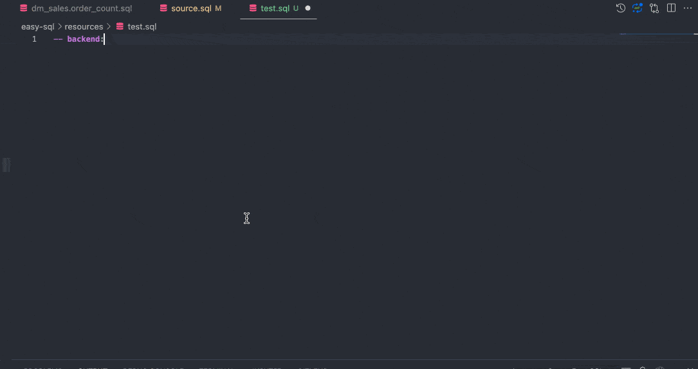

# Easy SQL extension for Visual Studio Code

This is the VS code extension for Easy SQL. A bunch of language features are supported.

For ETLs written in Easy SQL, keywords, variable reference, template reference, function calls etc are highlighted. More information will be provided if we hover on keywords or functions.

When we're coding in Easy SQL, realtime keyword and function completions are provided as well.

And if there is some syntax error, diagnostic information will be provided.

## Usage

Once installed in Visual Studio Code, the language feature will be enabled in every '.sql' file.

### Highlight

An example of hightlight screenshot is as below:


In order to make EasySQL related keyword more obvious, we can customize the colors a little. A recommended settings is as below:

```json
{
  ...
  "editor.tokenColorCustomizations": {
    "textMateRules": [
      {
        "scope": "keyword.target, keyword.config, keyword.prepare-sql, keyword.include",
        "settings": {
          "fontStyle": "bold"
        }
      }
    ]
  }
  ...
}
```

We can add this configuration to user settings.json to make it work. (Open command palette, search for `Open User Settings json`, add the content above to the opened `settings.json` file.)
This will make the keyword bold.

### Code completion

An example usage of code completion is as below:



Right now, keywords, functions completion will be provided.

### Diagnostics information

An example usage of diagnostics is as below:


Right now, syntax error diagnostics will be provided.

### More information on hover

An example usage of hover is as below:


Right now, keyword and function information are provided on hover.

## Features

- Hightlight keywords, function calls, variable reference, templates variables, template reference, conditional targets and other items in ETL.
- Provide diagnostics information on syntax error.
- Provide keyword/function completion when typing.
- Provide more information when hover on keyword and functions.

## Known Issues

- Semantic analysis support: variable could be put anywhere in a function call
- Semantic analysis support: template variable could be put anywhere in the template body

## Release Notes

Language features for ETLs written in Easy SQL, including syntax highlight, code completion, syntax diagnostics, and hover for more information.

### 1.7.x

- Completion: Complete for include command

### 1.6.x

- Diagnostic: Report error when template cannot be found from current file and including files
- Diagnostic: Report error when including files cannot be found
- References: Find references of some template

### 1.5.x
- Jump to definition: jump to temp table definition (with support for included files)
- provide template/template-variable completion with support for included files

### 1.4.x

- provide template/template-variable completion

### 1.3.x

- Jump to template definition
- Jump to file (for include target)

### 1.2.x

Hover: provide more doc for python system functions

### 1.1.x

Diagnostics improved: provide diagnostics for target definition

### 1.0.x

Basic code completion, diagnostics, hover for more information implemented.

### 0.2.0

Syntax highlight based on semantic analysis result.

### 0.1.0

Syntax highlight.

## Roadmap

- [√] Completion from included files: provide template/template-variable completion
- [√] Jump to definition: jump to template definition in included files
- [√] Jump to definition: jump to temp table definition in included files
- [√] Report error when template cannot be found from current file and including files
- [√] Report error when including files cannot be found
- [√] Find references of some template
- [√] Completion: provide include completion
- Refactor: renaming of template name
- Refactor: renaming of template args
- Completion: provide variable completion
- Completion from included files: provide variable completion
- Jump to definition: jump to var definition in current file and in included files
## For more information

- [Easy SQL](https://github.com/easysql/easy_sql)
- [Easy SQL syntax](https://easy-sql.readthedocs.io/en/latest/easy_sql/syntax.html)

**Enjoy!**
